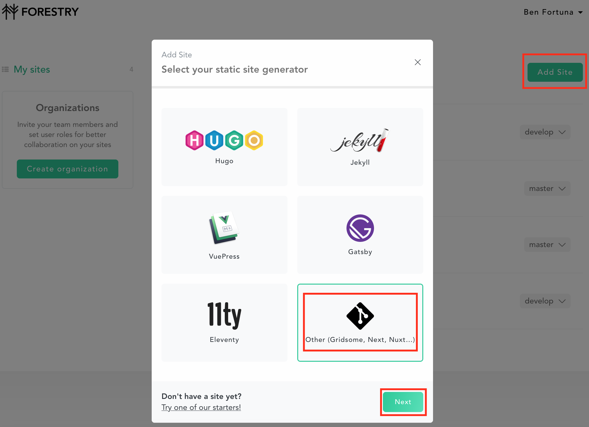
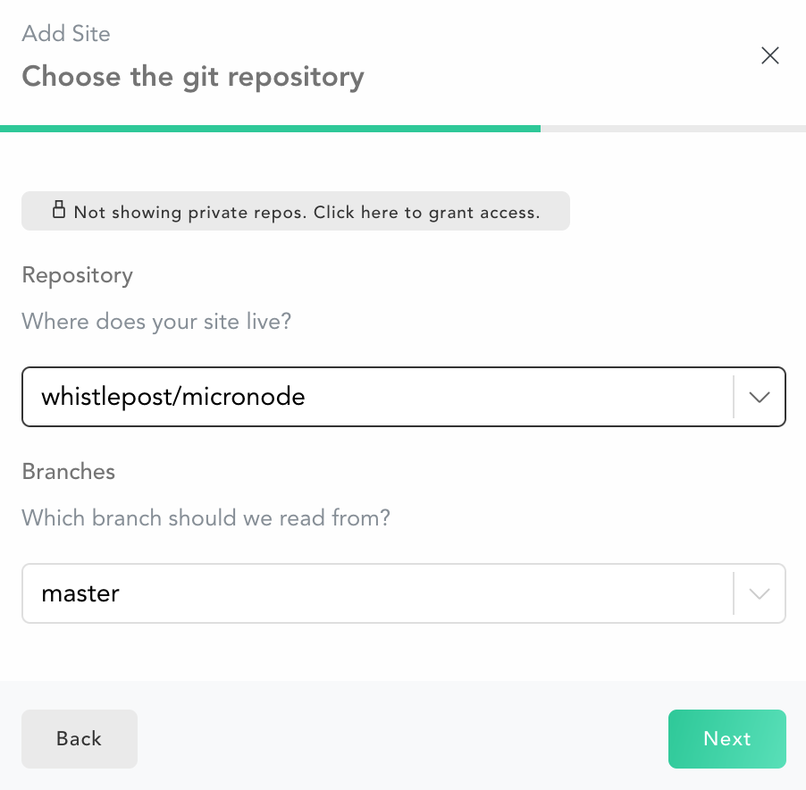
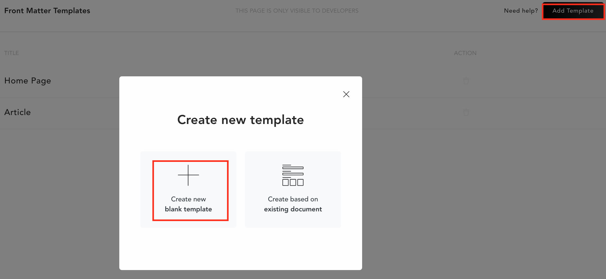
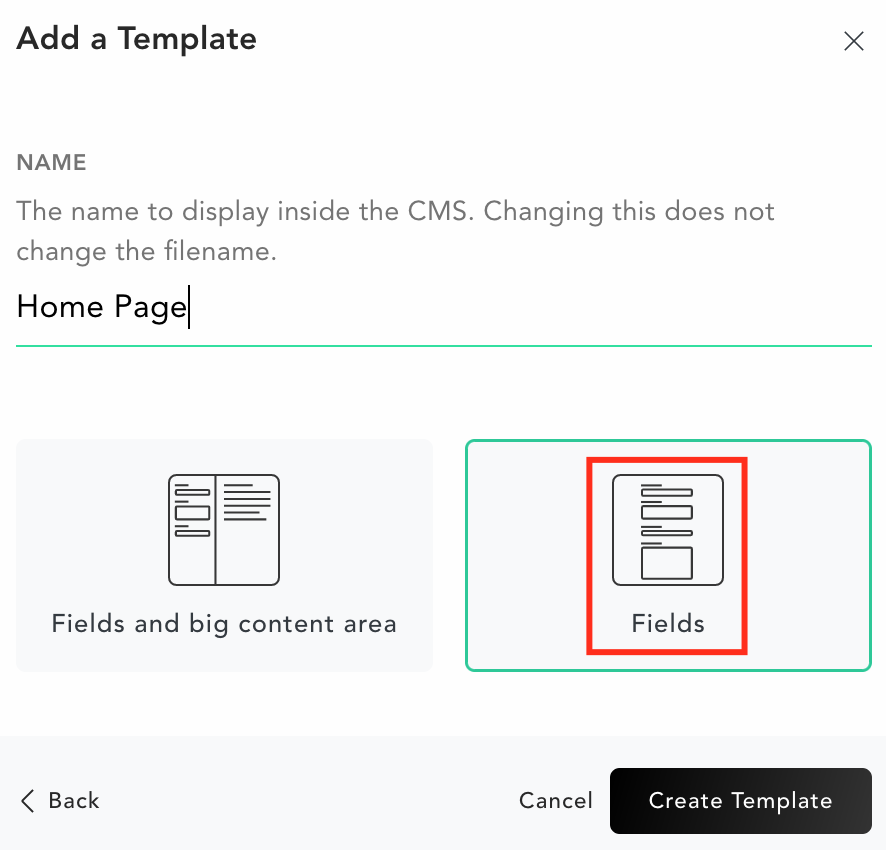
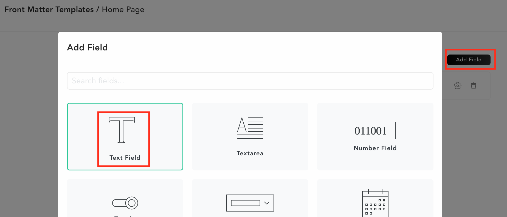

[Forestry.io]: https://forestry.io/

# Publishing with Forestry.io
This page outlines how to use **Forestry.io** to publish Whistlepost content.

## Overview

[Forestry.io] is an online content management tool targeting content for static site generators such as Hugo, Jekyll, Gatsby, etc. However this tool is versatile enough to support custom content formats, including JSON as used to manage Whistlepost content.

The added benefit of Forestry.io is that you can integrate with version control and content storage tools such as GitHub and AWS S3, thus providing you will full control over your content management.

## Getting Started

1. First you will need to sign up to [Forestry.io], with one of the provided plans. The free plan is sufficient for single user content management, however for larger teams you may need to consider the paid plans. 

2. After signing you may then create a new site from the dashboard.

3. Select the Git provider where you will store your content.

4. On the next page, after authorizing access to your repositories select the repository where you will store your site content. After clicking _Next_ Forestry.io will import the content from your repository to construct a site dashboard.

## Creating templates

In Forestry _Front Matter Templates_ are used to define the structure of content documents. We can use templates to define how Whistlepost content should be saved.

1. Navigate to Front Matter and click _Add Template_. Click to create a new blank template.

2. Provide a name for the new template and select the option for _Fields_ (without content area).

3. Define content fields for the template using the _Add Field_ button. Typically we use the _Text Field_ option to define a single row content field.

